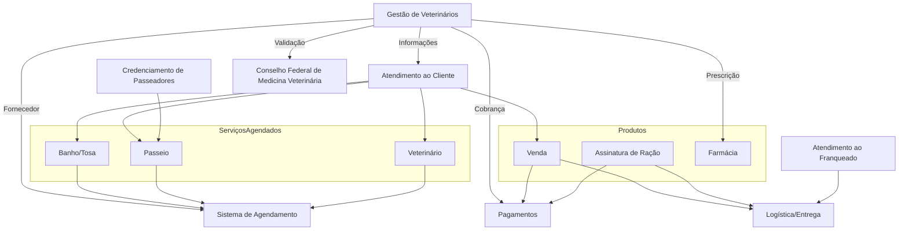

# Design Patterns e Domain-Driven Design (DDD) com Java [26E2_2]

## Bounded Contexts da Pet Friends
- Atendimento ao Cliente  
- Atendimento ao Franqueado  
- Produtos  
  - Venda  
  - Assinatura de Ração  
- Serviços Agendados  
  - Veterinário  
  - Banho/Tosa  
  - Passeio  
- Credenciamento de Passeadores  
- Gestão de Veterinários  
- Conselho Federal de Medicina Veterinária (CFMV)  
- Pagamentos  
- Logística/Entrega  

---

## Classificação dos Subdomínios
| Subdomínio | Tipo | Justificativa |
|------------|------|---------------|
| Gestão de Veterinários | Principal | Núcleo do TP3, envolve cadastro, validação e agenda dos profissionais. |
| Agendamento | Principal | Sem ele não há organização de consultas, passeios ou banho/tosa. |
| Produtos | Principal | Base da receita da empresa (e-commerce e assinaturas). |
| Pagamentos | Genérico | Necessário para todas as transações, mas não é diferencial competitivo. |
| Logística/Entrega | Suporte | Garante que produtos e serviços cheguem ao cliente, mas não é o core. |
| Atendimento ao Cliente | Suporte | Suporte operacional e comunicação. |
| Atendimento ao Franqueado | Suporte | Gestão administrativa da rede. |
| Credenciamento de Passeadores | Suporte | Complementa serviços, mas não é central. |
| Conselho Federal de Medicina Veterinária | Genérico | Entidade externa obrigatória para validação dos profissionais. |

---

## Mapa de Contexto (Mermaid)

---

## Estratégias de Comunicação
- **Veterinários ↔ Agendamento**  
  - Estratégia: comunicação interna via **gRPC**.  
  - Benefício: sincronização rápida de disponibilidade.  

- **Veterinários ↔ CFMV**  
  - Estratégia: **camada anticorruptiva** consumindo APIs externas via **HTTP/JSON**.  
  - Benefício: protege o sistema interno e garante conformidade legal.  

- **Veterinários ↔ Produtos (Farmácia)**  
  - Estratégia: integração via **eventos assíncronos** (mensageria).  
  - Benefício: prescrição dispara evento sem travar fluxo.  

- **Veterinários ↔ Pagamentos**  
  - Estratégia: comunicação síncrona via **HTTP/JSON**.  
  - Benefício: confirmação imediata da transação.  

- **Veterinários ↔ Atendimento ao Cliente**  
  - Estratégia: integração via **API REST**.  
  - Benefício: cliente visualiza status da consulta e prescrições.  
