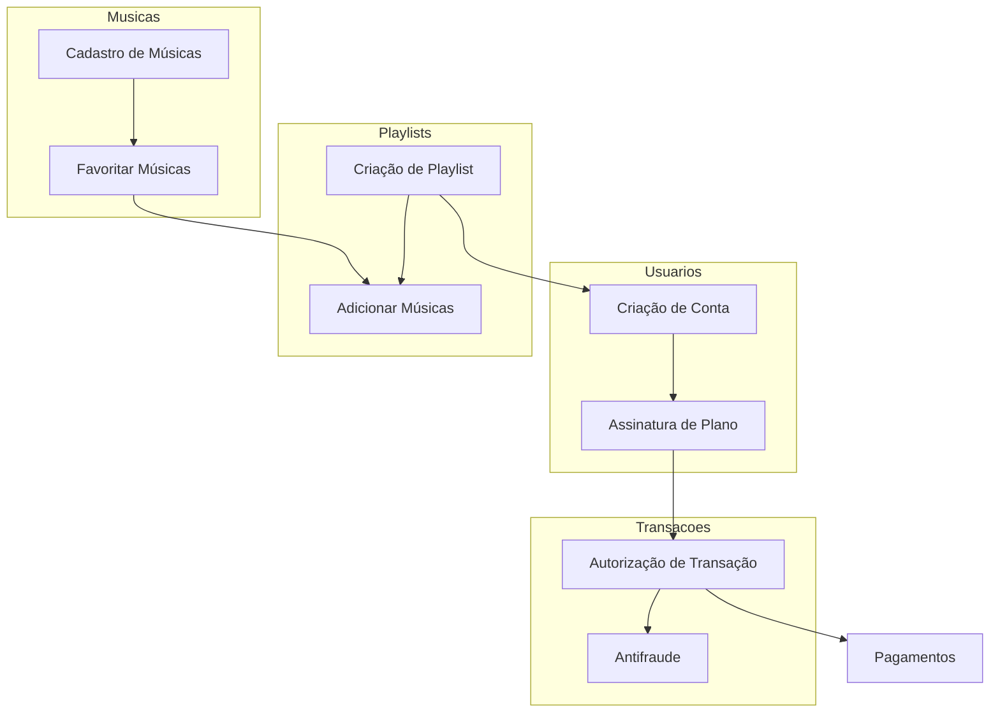
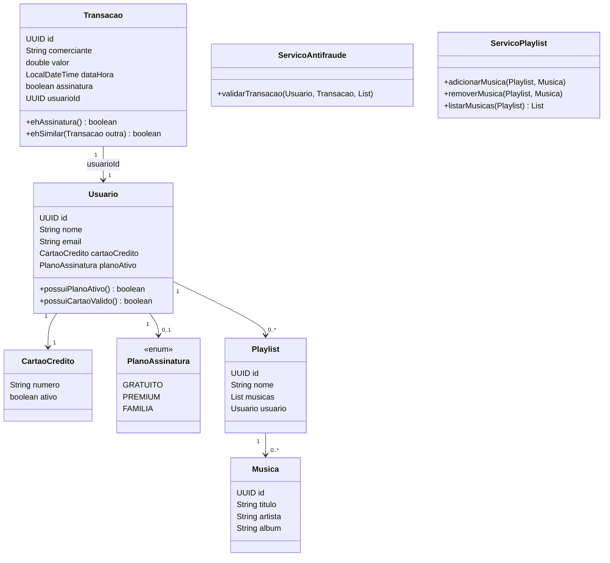
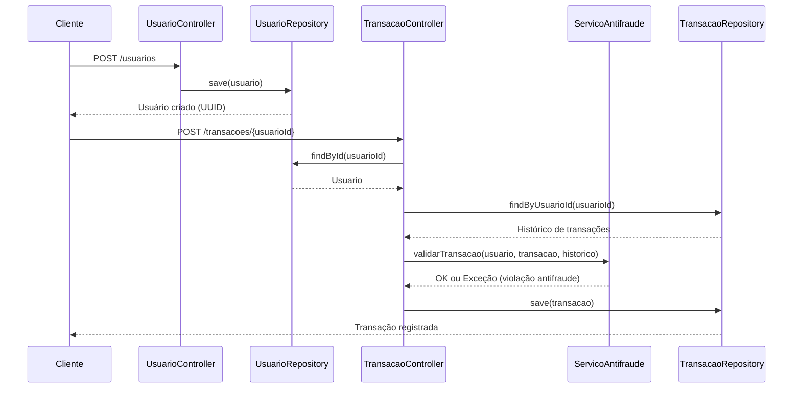
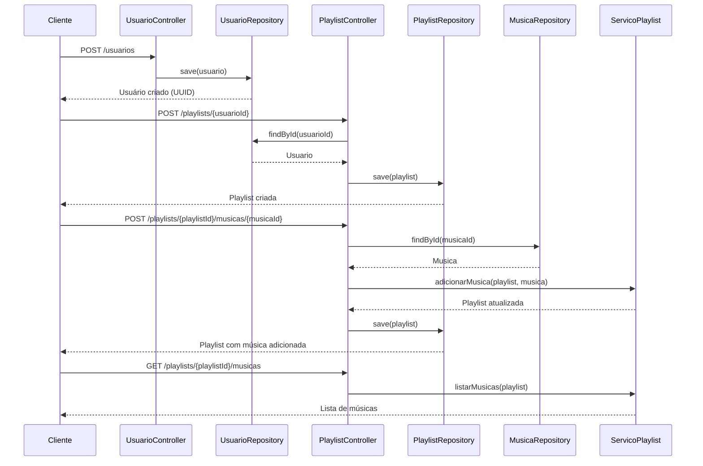

# Design Patterns e Domain-Driven Design (DDD) com Java [AT-DDD]
## Bounded Contexts do Streaming de Música

- Usuários
  - Criação de conta
  - Assinatura de plano
- Transações
  - Autorização de transações
  - Regras antifraude
- Músicas
  - Cadastro de músicas
  - Favoritar músicas
- Playlists
  - Criação de playlists
  - Associação de músicas a playlists vinculadas a usuários
- Pagamentos
  - Processamento de transações
  - Validação de cartão de crédito

---

## Classificação dos Subdomínios
| Subdomínio | Tipo | Justificativa |
|------------|------|---------------|
| Usuários |	Principal	| Núcleo do sistema, gerencia contas e planos de assinatura. |
| Transações |	Principal |	Essencial para autorizar compras e aplicar regras antifraude. |
| Músicas |	Principal	| Base da experiência do usuário, envolve cadastro e favoritos. |
| Playlists |	Principal	| Diferencial competitivo, organiza músicas e personaliza experiência. |
| Pagamentos |	Genérico |	Necessário para todas as transações, mas não é diferencial competitivo. |

---

## Mapa de Contexto (Mermaid)

---

## Diagrama de Classes (Mermaid)

---

## Diagrama de Sequência – Transações (Mermaid)

---

## Diagrama de Sequência – Playlists (Mermaid)

---

## Estratégias de Comunicação
- **Usuários ↔ Transações**
  - Estratégia: comunicação interna via API REST.
  - Benefício: garante que apenas usuários válidos possam realizar transações.

- **Transações ↔ Pagamentos**
  - Estratégia: comunicação síncrona via HTTP/JSON.
  - Benefício: confirmação imediata da transação e aplicação das regras antifraude.

- **Usuários ↔ Playlists**
  - Estratégia: integração via API REST.
  - Benefício: playlists vinculadas diretamente ao usuário, sem recursão infinita.

- **Playlists ↔ Músicas**
  - Estratégia: relacionamento via Many-to-Many no banco de dados.
  - Benefício: flexibilidade para adicionar/remover músicas sem duplicação.
